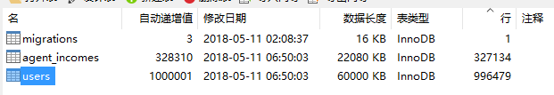

# 项目说明

简单测试百万级项目代码逻辑, 暂不进行深层测试

# 测试环境

1. 虚拟机 2核4G
2. php7.2+ mysql5.7+
3. 推荐使用Homestead
4. 如果使用mysql5.7以下版本 请加入低版本兼容处理方案
```php
    //app/Providers/AppServiceProvider.php 文件路径
    public function boot()
    {
        //兼容低版本mysql
        \Schema::defaultStringLength(191);
    }
```


# 安装教程

用laravel5.5初始化一个项目 , 在使用本项目文件覆盖之前初始化的项目

# 使用说明

1. 先执行 php artisan migrate 迁移测试表
2. 再执行 php artisan db:seed 生成测试数据 (100万条用户信息)
    > 如果需要修改测试数据 文件路径database/seeds/DatabaseSeeder.php
 
    > 此命令按上面推荐配置 大概需要20分钟
3. 上面命令执行成功后再执行 php artisan test
    > 此命令按上面推荐配置 大概需要50分钟
# 测试效果


